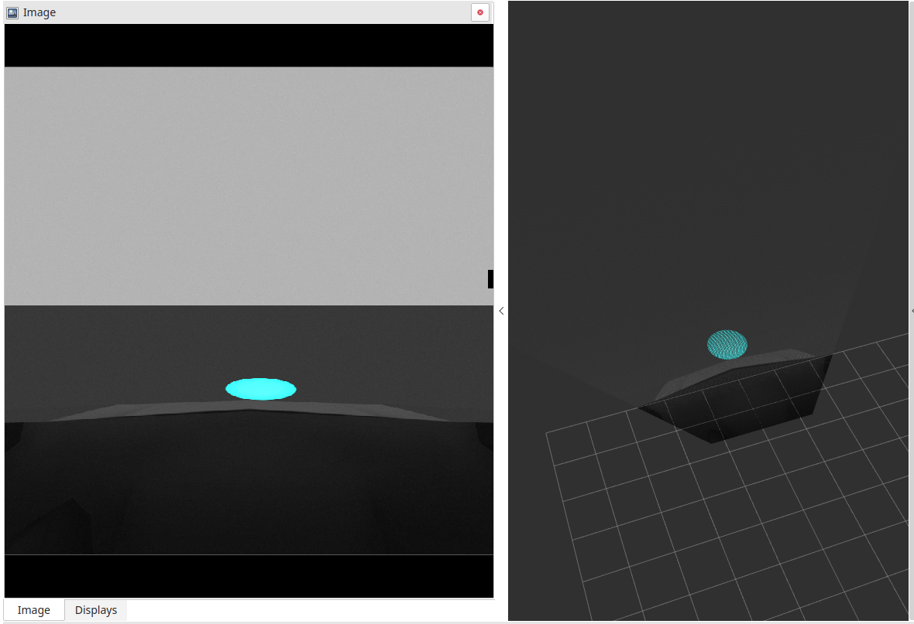
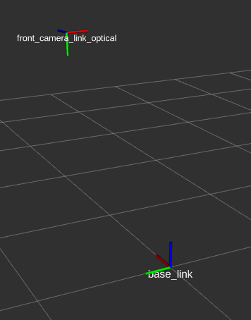
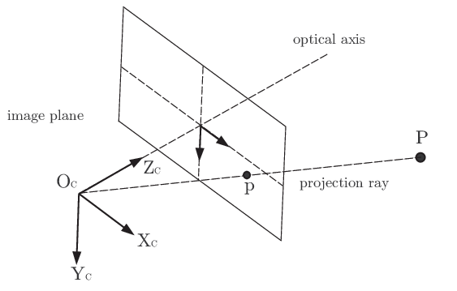

# 逆透视变换



本节点将 图片 转换为 点云，转换公式为：
$$
    aa
$$

## 节点输入

### 相机信息
需要 **camera_info** 以及 **image_raw**,图片需经过 **去畸变** 处理，节点内部采用 **针孔相机** 模型。

### TF-tree

1. 底盘坐标系
    
    X朝向车头前方，Z垂直地面向上，XY平面与地面重合
    
2. 相机坐标系
   
    

    Z轴方向为光轴朝向


## 节点输出
PointCloud2

坐标系为base_link

## 示例
使用rosrun
``` shell
    rosrun image_to_pointcloud i2p_node _cam_link:=front_camera_link_optical _car_link:=base_link _pointcloud_topic:=cic_points _camera_topic:=/prius/front_camera/image_raw

```

使用roslaunch

```xml
<?xml version="1.0"?>
<launch>
    <node pkg="image_to_pointcloud" type="i2p_node" name="i2p_node">
        <param name="cam_link" value="front_camera_link_optical" />     
        <param name="car_link" value="base_link" />     
        <param name="pointcloud_topic" value="cic_points" />     
        <param name="camera_topic" value="/prius/front_camera/image_raw" />     
      </node>
</launch>
```

### 实例数据包

rosbag play --rate   --clock -l  demo.bag          